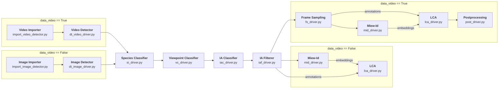

# Video-Based Animal Re-Identification (VARe-ID) from Multiview Spatio-Temporal Track Clustering

This work is a modular software pipeline and end-to-end workflow for video-based animal re-identification that clusters multiview spatio-temporal tracks to assign consistent individual IDs with minimal human review. From raw video, we detect and track animals, score and select informative left/right views, compute embeddings, cluster annotations/embeddings by viewpoint, and then link clusters across time and disparate views using spatio-temporal track continuity plus automated consistency checks to resolve ambiguities; preliminary experiments show the approach can reach near-perfect identification accuracy with very little manual verification. This workflow is designed to be generalizable across different species. Currently, the trained models support Grevy's and Plains Zebras but it will be expanded to work with variety of other animal species.

### Tags: 
- Software
- CI4AI
- Animal-Ecology

---
# Software Structure

## Definitions of Key Terms and Concepts

* **Animal Re-Identification (re-id)**: The process of determining if an animal has been seen before by matching it against a database of images with known identity labels. The paper addresses this problem in the context of long video sequences.
* **Multiview Spatio-Temporal Track Clustering**: A novel framework introduced for animal re-identification. It works by clustering tracked animal detections from different viewpoints (multiview) and across time (spatio-temporal) to correctly identify individuals.
* **Identifiable Annotation (IA)**: An annotation, or detected animal image, that contains sufficient distinguishing information for reliable individual identification. For Grévy's zebras, an IA must show both the hip and chevron patterns on either the left or right side.
* **Human-in-the-loop**: The involvement of human decisions to confirm animal identities when the automated system is uncertain or to correct algorithmic errors.

## Repository File Structure

The following is a simplified hierarchy of the file structure using in this repository.

```
VAREID
├── algo
|   ├── detection/
|   ├── frame_sampling/
|   ├── ia_classification/
|   ├── import/
|   ├── lca/
|   ├── miew_id/
|   ├── postprocessing/
|   ├── species_identification/
|   └── viewpoint_classification/
├── drivers/
├── models/
├── tools/
├── libraries
|   ├── db/
|   ├── io/
|   ├── logging/
|   ├── ui/
|   └── constants.py
|   config.yaml
└──   snakefile.smk
```

The repository can generally be split into four groups of code:

#### Algorithm Components
Algorithm components are the invidual steps of the pipeline, such as detection or species classification. They are contained in `VAREID/algo/[component_name]/` in separate directories. In some specific cases, two components may share the same directory, such as `video_detector.py` and `image_detector.py`. Their only dependency (within this repository) would be library functions. Every component here should have an executable script to run that step of the pipeline.

For more information on each algorithm component, please view the **README** files in each of their corresponding directories. Their arguments are also documented via the **argparse** python library.

#### Pipeline (Snakemake)
The pipeline's workflow is built using **Snakemake**. The workflow is defined in `snakefile.smk`, via executions to **driver scripts**.

The snakefile reads in a configfile structured like `config.yaml`. To build a configfile, please follow the notations found in the example `config.yaml`.

#### Driver Scripts
Driver scripts serve as connectors between the pipeline and the algorithm components. They handle determining conditional arguments passed to algorithm components (such as flags or variations in parameters based on image vs. video mode), setting up logging, building the command, and executing the algorithm component. Every algorithm component must have a driver script associated with it.

#### Libraries
The libraries contain all util functions used throughout the pipeline. These libraries range from database operations (e.g. image tables and directories), IO (image/video importing, loading/saving data, etc.), logging, UI, and more.

### Other important files and directories...
In addition to the above structure, there's a few more important directories to note. 

#### Models
All models are stored in the `VAREID/models/` directory. This primarily includes the `.pth` files for the viewpoint classifier and IA classifier models. It also includes the verifiers probabilities used by LCA, but this is being phased out.

#### Tools
This directory contains some prototype tools that provide convenience and extra functionality to users. `visualize.py` is a script that draws and labels specific annotations. `extrapolate_ggr_gps.py` extrapolates GPS data for images missing it, which is specific functionality for images taken by the same camera with timestamp data.

#### environment.yaml
This is the file defining the python environemnt requirements for this repository. Use this file with a package manager like **conda** to build an environment. More on this in the **How-To** section.

## Pipeline Workflow

The following is a flowchart describing the workflow of the pipeline, along with the associated driver script for each stage.



---
# How-To

This section walks through how to use this repository and its features. It is split into sections based on the types of tasks you're looking to accomplish.

## Setting up a Python Environment
You'll need to setup a python envionment that meets the requirements layed out in `environment.yaml`. There's several package managers that revolve around **conda** as well as the more-efficient reimplementation **mamba**. Pick your favorite and use its documentation to set up an environment. To setup the environment, you'll need to do a command similar to the following:

From the parent directory...

| Package Manager | Command |
| ----------- | ----------- |
| conda (Miniconda/Anaconda) | `conda env create -n [env name] -f environment.yaml` |
| mamba | `mamba create -n [env name] -f environment.yaml` |

The choice of what package manager to use is up to you.

### Activate your environment:
The commands to activate your envioronment are as follows:

| Package Manager | Command |
| ----------- | ----------- |
| conda (Miniconda/Anaconda) | `conda activate [env name]` |
| mamba | `mamba activate [env name]` |

## Setting up a Configfile
Please follow the instructions provided by comments in `config.yaml`. You can directly edit and use this file if you wish, but we **highly recommend** filling out a copy. This way, you can save the configs for each experiment and refer to them later (or run several experiments at once). 

Unless you'd like to customize the exact output filenames and directories, the following config fields matter the most:

The following fields are **required**:
- `data_dir_out`: This is the output directory to save to.
- `data_dir_in`: This is the input directory to read to.
- `data_video`: This is a boolean (True/False) specifying whether to process image or video data.

The following fields are **optional** and either have default (recommended) values already in the configfile or are blank (fully optional):
- `dt_gt_file` and `dt_filtered_out_file`: In the case that you're running image data with ground truth data, you can find and filter detections by IOU (Intersection over Union) with the ground truth detections.
- `fs_stage1_out_file`: This field, if supplied, will save an additional output from frame sampling after its first stage.
- `lca_separate_viewpoints`: This field specifies whether to split and save annotation files by each viewpoint or to save them alltogether. **In video mode, this MUST be True!**

## Running the Pipeline
To run the pipeline, you'll execute `snakefile.smk`.

**Please run the snakefile from the parent directory in this repository.** For more information on how to run a snakefile (e.g. available flags), please view the [Snakemake Docs](https://snakemake.readthedocs.io/en/stable/executing/cli.html). The most important flags you'll need to specify are as follows: 

| Flag | Function |
| ----------- | ----------- |
| -s | The path to the snakefile, which should be `snakefile.smk` |
| --cores | The number of CPU cores you'd like to run on. |
| --configfile | The path to the configfile you're using. Defaults to `config.yaml` if not provided. |

Put it together, your command will look like the following:

```
snakemake -s snakefile.smk --cores 1 --configfile path/to/your_config.yaml
```

Note that your configfile can be supplied by any filepath, relative or absolute.

**As long as you use separate config files between executions, it is safe to run several processes simultaneously.**

### The `--unlock` Flag:
Sometimes you won't be able to execute the snakefile and you'll get an error telling you to unlock the DAG (DAG is the workflow as a directed acyclic graph). This may happen if the process unexpectedly stops (such as timing out on a HPC cluster) and no error is reciprocated back to the snakefile. In order to solve this, you'll need to run a command similar to the following:

```
snakemake -s snakefile.smk --unlock
```

## Running an Algorithm Component in Isolation
Sometimes you don't want to run the full pipeline but rather just a specific algorithm step. There's two ways to do this:

### Using the driver script (RECOMMENDED)
We recommend executing specific algorithm components using their corresponding driver script in `VAREID/drivers/` for the simplicity of user input and consistent logging with a pipeline execution.

Driver scripts require a complete configfile structured like `config.yaml`. **All required fields, including those for other stages of the pipeline, must be filled out.** Once again, your configfile can be supplied by any filepath, relative or absolute.

Since the pipeline was installed as a module, you can easily execute the driver script through this module. No matter what directory you execute from, the path to the driver script will be the same (and relative to VAREID).
```
python -m VAREID.drivers.[driver_script] --config_path path/to/your_config.yaml
```
Notice that we didn't include the `.py` extension on the driver. This is because we're referencing it as a module. Think of this like an import statement, `import VAREID.drivers.[driver_script]`, but you're executing it as a script.

### Using the algorithm component itself
If you don't have a full configfile filled out or would rather not rely on it, you can directly execute each algorithm component using its executable script. Each algorithm component has a separate set of parameters documented with `argparse` Please follow these parameters for your desired component and supply the necessary paths, flags, etc.

## Executing tools or any other scripts
Please see the documentation in these scripts, which is usually done via `argparse`.

---

### License
- MIT [](https://opensource.org/licenses/MIT)

  
## References

### Links to related resources (libraries, tools, etc.) or external documentation
* [YOLOv10](https://github.com/THU-MIG/yolov10)
* [BioCLIP](https://github.com/Imageomics/bioclip)
* [MiewID](https://github.com/WildMeOrg/wbia-plugin-miew-id)
* [LCA](https://github.com/WildMeOrg/lca)

   
## Acknowledgements

* **National Science Foundation (NSF)** funded AI institute for Intelligent Cyberinfrastructure with Computational Learning in the Environment (ICICLE) (OAC 2112606).
* **Imageomics Institute (A New Frontier of Biological Information Powered by Knowledge-Guided Machine Learning)** is funded by the US National Science Foundation's Harnessing the Data Revolution (HDR) program under Award (OAC 2118240).
* Support from **Rensselaer Polytechnic Institute (RPI)**.
* Support from **Finnish Cultural Foundation**.
* Resources from **Ohio Supercomputer Center** made it possible to train and test algorithmic components.

